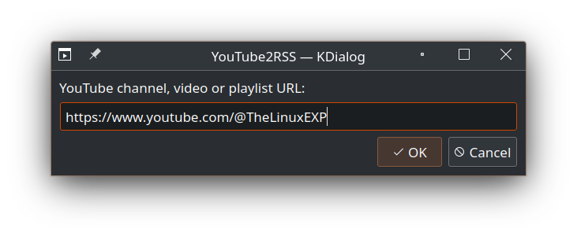
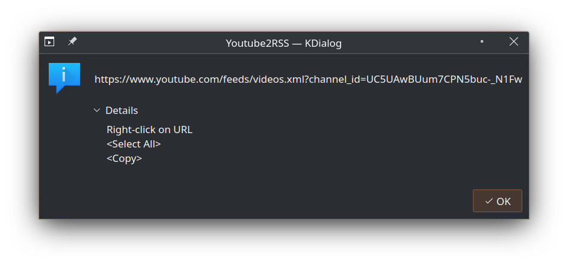

## YouTube2RSS
Create the RSS link from a YouTube channel, video or playlist URL.

### Usage:
Copy the YouTube URL on your clipboard and paste it in the prompt field. If the URL is a channel or video, creates RSS link to the channel. If the URL is a playlist, creates RSS to that playlist only.

After clicking OK, you have your RSS link created.

Click OK to paste another URL o close the windows to finish.
### Requirement:
**kdialog** is required to run this app. Non-KDE users will probably have to install it.

### How to install:
No installation, is just one file (*youtube2rss.sh*). Download, and run it.